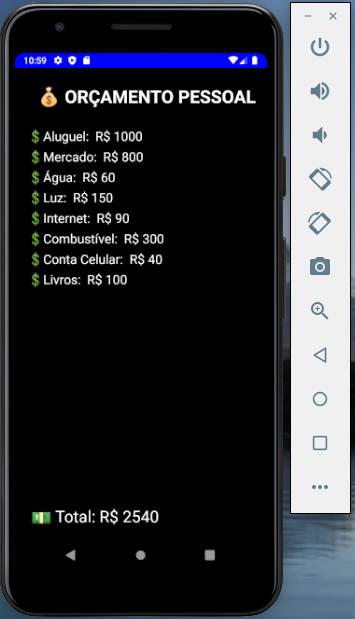

<div align="center">
    <h1>Orçamento pessoal</h1>
<div>

<div align="center">
    
<div>

---

<div align="center">
    
<div>

---

<h2 align="left">Sobre</h2>

<p align="left">
    Projeto desenvolvido aproveitando conceitos aprendidos durante a primeira semana do curso GoStack: NodeJS no back-end, ReactJS para o front-end, React-Native para mobile. 
</p>

<p align="left">
    A aplicação consiste em cadastrar itens de orçamento pessoal, como categoria da despesa prevista e seu valor.
</p>

<p align="left">
    No momento o projeto está em desenvolvimento e muitas funcionalidades, como persistência dos dados, inclusão de despsas, entre outras, serão adicionadas posteriomente.
</p>

---

<h2 align="left">Tecnologias</h2>

<div align="left">
    <li>ReactJS</li>
    <li>React Native</li>
    <li>NodeJS</li>
<div>

---

<h2 align="left">Clonar repositório</h2>

```bash
    $ git clone https://github.com/AndreDalSantos/personal-budget-project.git
```

---

<h2 align="left">Executar servidor</h2>

```bash
    # Acessar diretório do servidor
    $ cd personal-budget-project/backend
    
    # Instalar dependências
    $ yarn install

    # Iniciar a aplicação
    $ yarn dev
``` 

<h3 align="left">API em: http://localhost:3333<h3>

---

<h2 align="left">Executar projeto web</h2>

```bash
    # Acessar diretório do servidor
    $ cd personal-budget-project/frontend
    
    # Instalar dependências
    $ yarn install

    # Iniciar a aplicação
    $ yarn dev
``` 

<h3 align="left">Web em: http://localhost:8080<h3>

---

<h2 align="left">Executar projeto mobile</h2>

```bash
    # Acessar diretório do servidor
    $ cd personal-budget-project/mobile
    
    # Instalar dependências
    $ yarn install

    # Iniciar a aplicação
    $ yarn start
``` 

<h3 align="left">Para inicializar o projeto mobile, seguir uma das opções em src/services/api.js<h3>

```bash
    # Em outro terminal carregar o emulador:
    $ npx react-native run-android
```